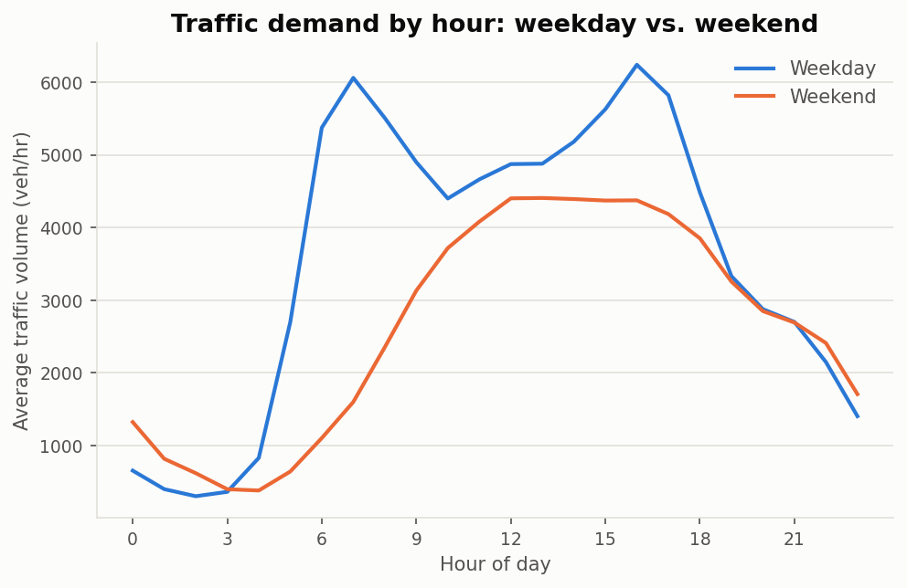
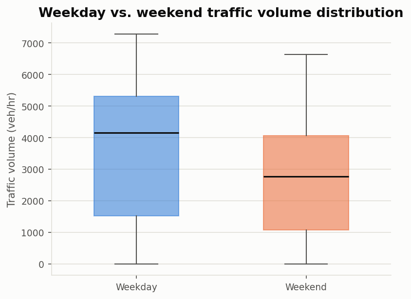
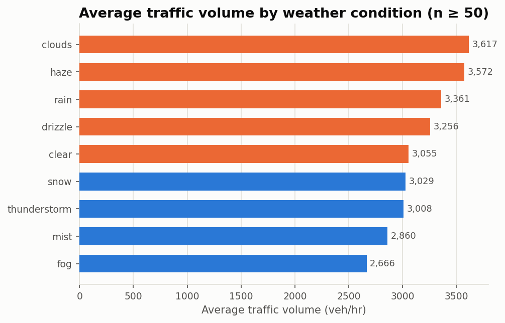
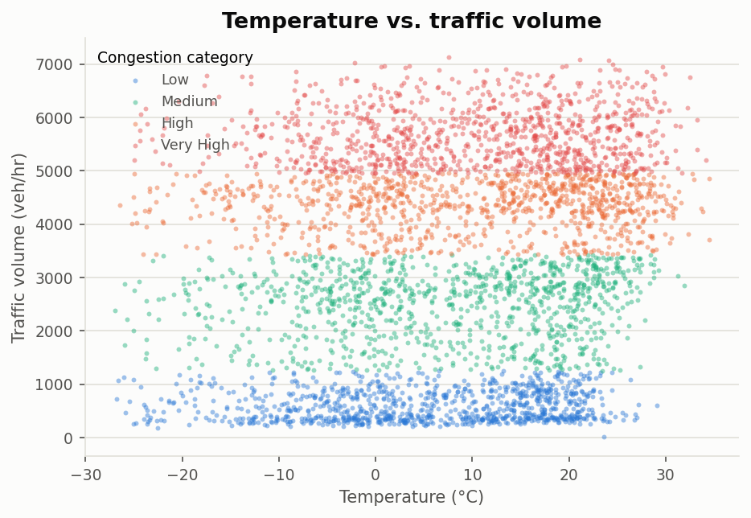
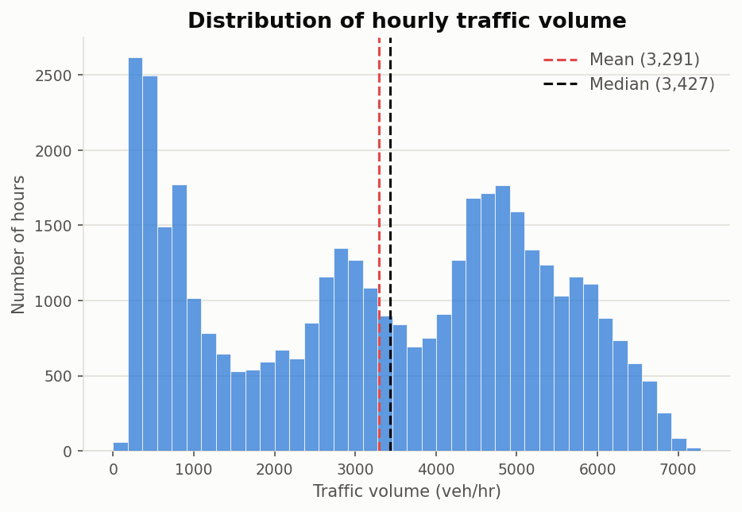
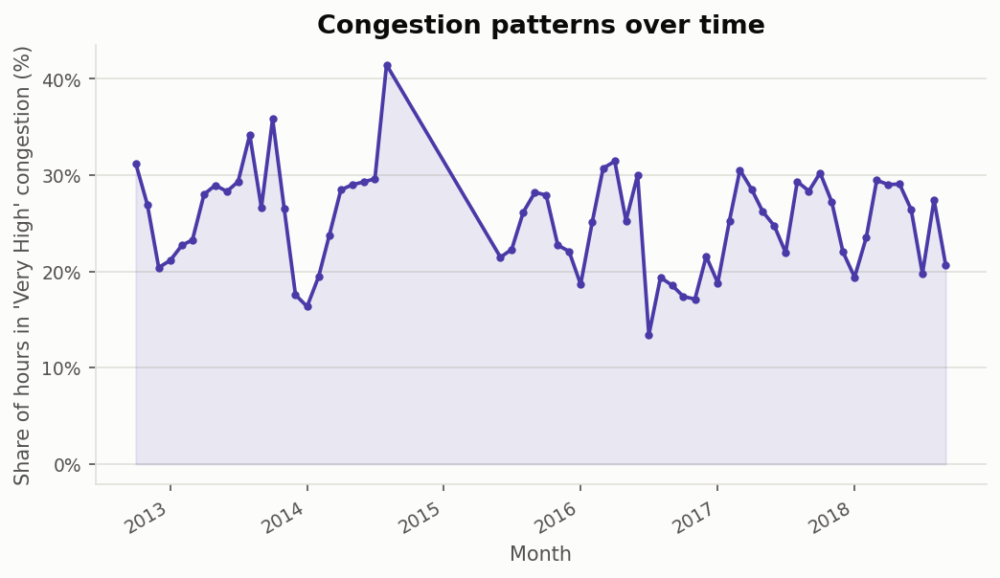

# Visualisation Interpretations

## 1. Traffic demand by hour (weekday vs. weekend)

Weekday traffic is bimodal, peaking at 16:00 (6,241 veh/hr) with a clear commute pattern, while weekend traffic peaks later and flatter at 13:00 (4,408 veh/hr) with no morning rush. Weekdays exceed weekends by 944 veh/hr on average, confirming this corridor is primarily commute-driven.

## 2. Weekday vs. weekend traffic distribution

Median weekday volume (4,159 veh/hr) is 1,388 veh/hr higher than the weekend median (2,770 veh/hr), and the weekday box is visibly taller (wider interquartile range) -- weekday traffic swings much harder between off-peak and rush-hour levels, while weekends stay comparatively steady across the day.

## 3. Traffic and weather relationship

'Clouds' carries the highest average volume (3,617 veh/hr) and 'Fog' the lowest (2,666 veh/hr), a difference of 951 veh/hr. The spread is real but modest relative to the overall variability in traffic volume -- weather condition alone is a weak lever for predicting congestion.

## 4. Temperature vs. traffic

Pearson r = 0.139 between temperature and traffic volume -- a weak positive relationship; temperature alone explains only a small share of the variance. The point cloud is fairly flat through most of the range and only thins out toward the coldest hours, where volume drops noticeably -- extreme cold suppresses traffic more clearly than moderate temperature varies it.

## 5. Traffic distribution

The distribution is bimodal, not a single bell curve: a large cluster of low-traffic overnight hours sits well apart from a second cluster of rush-hour readings. Skewness is only mild (-0.11) and the mean (3,291) sits just below the median (3,427) -- the more important story is the two-regime shape than the direction of the skew. There is no single 'typical' hour: the corridor alternates between distinct off-peak and peak regimes.

## 6. Congestion patterns over time

The share of severely congested hours varies substantially month to month, peaking at 41% in August 2014. Coverage gaps in the underlying sensor data (documented in Part 1) mean some of this swing reflects which months were measured as much as real seasonal demand -- read this chart as directional rather than a precise seasonal forecast.
